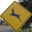
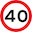

##### Build a Traffic Sign Recognition Project

*1. Provide a basic summary of the data set. In the code, the analysis should be done using python, numpy and/or pandas methods rather than hardcoding results manually.*

I used the pandas library to calculate summary statistics of the traffic
signs data set:

* The size of training set is 34799
* The size of the validation set is 4410
* The size of test set is 12630
* The shape of a traffic sign image is 32,32,3
* The number of unique classes/labels in the data set is 43

*2. Include an exploratory visualization of the dataset.*

I have plotted the counts of images belonging to the different classes in the python notebook.

##### Design and Test a Model Architecture

*1. Describe how you preprocessed the image data. What techniques were chosen and why did you choose these techniques? Consider including images showing the output of each preprocessing technique. Pre-processing refers to techniques such as converting to grayscale, normalization, etc. (OPTIONAL: As described in the "Stand Out Suggestions" part of the rubric, if you generated additional data for training, describe why you decided to generate additional data, how you generated the data, and provide example images of the additional data. Then describe the characteristics of the augmented training set like number of images in the set, number of images for each class, etc.)*

After plotting the counts of images in the training set against the 43 classes. It can be seen that a few classes have very few samples in the training set and are under represented. I have used rotation and shifting by random amounts to generate more images for the classes that have very few training data.

In addition to adding images the training set is converted to grayscale. The lesson explains how we eliminate features that do not matter for the classification. I read several other resources on image transformations. The normalization of the images improved my prediction significantly.

*2. Describe what your final model architecture looks like including model type, layers, layer sizes, connectivity, etc.) Consider including a diagram and/or table describing the final model.*

I have used the lenet architecture as specified in the udacity lectures. I have added a batch normalization step after the first convolution later that improved my training accuracy by ~40%.

*3. Describe how you trained your model. The discussion can include the type of optimizer, the batch size, number of epochs and any hyperparameters such as learning rate.*

This step took the longest. I experimented with several different optimizers and learning rates. I started with adding more images but the basic lenet architecture. I was able to achieve about to get ~50% accuracy on the validation step. I then added the batch normalization that took it up to ~85%. I experimented with adding more convolution layers as well. The learning rate and different optimizers were impacting how many epochs it took to get to 80%. None of them would improve the accuracy. I then read some other resources on image transformations and tried reducing the number of images I was adding to the training test. The improved the model training as well as validation accuracy.

I experimented with several different learning rates. Also tried several optimizers provided by tensorflow. The Adam optimizer used was the fastest at training the model.

*4. Describe the approach taken for finding a solution and getting the validation set accuracy to be at least 0.93. Include in the discussion the results on the training, validation and test sets and where in the code these were calculated. Your approach may have been an iterative process, in which case, outline the steps you took to get to the final solution and why you chose those steps. Perhaps your solution involved an already well known implementation or architecture. In this case, discuss why you think the architecture is suitable for the current problem.*

Described above

If an iterative approach was chosen:
* What was the first architecture that was tried and why was it chosen?
* What were some problems with the initial architecture?
* How was the architecture adjusted and why was it adjusted? Typical adjustments could include choosing a different model architecture, adding or taking away layers (pooling, dropout, convolution, etc), using an activation function or changing the activation function. One common justification for adjusting an architecture would be due to overfitting or underfitting. A high accuracy on the training set but low accuracy on the validation set indicates over fitting; a low accuracy on both sets indicates under fitting.
* Which parameters were tuned? How were they adjusted and why?
* What are some of the important design choices and why were they chosen? For example, why might a convolution layer work well with this problem? How might a dropout layer help with creating a successful model?

If a well known architecture was chosen:
* What architecture was chosen?
* Why did you believe it would be relevant to the traffic sign application?
* How does the final model's accuracy on the training, validation and test set provide evidence that the model is working well?
 

##### Test a Model on New Images
*1. Choose five German traffic signs found on the web and provide them in the report. For each image, discuss what quality or qualities might be difficult to classify.*

I downloaded some stock photos and cropped traffic signs from bigger images of a google image search. These images were not particularly from the german traffic sign set. More a random set of traffic signs. Quite a few of the images cannot be classified by the given label set. For example the speed limit of 40 km/hr. The label's include 20,60,80 but not 40. I wanted to try the model with these images, curious to see what it picks. I also picked one that says vehicles cannot carry explosive materials. Not sure if this is a real sign or some sort of internet joke.

Some of the images are as follows
   

*2. Discuss the model's predictions on these new traffic signs and compare the results to predicting on the test set. At a minimum, discuss what the predictions were, the accuracy on these new predictions, and compare the accuracy to the accuracy on the test set (OPTIONAL: Discuss the results in more detail as described in the "Stand Out Suggestions" part of the rubric).*
When i try the model with images that are not resized to squares. The predictions were far worse. I then cropped and resized the images to 32,32,3 and the predictions improved. For a few images classification is not possible as the images do not map to any of the 43 classes. 

The accuracy is ~22% or 4 out of 18 images. If you adjust the image sizes on the children crossing. I was able to get the right prediction, I have since forgotten the size for which the prediction worked. 

*3. Describe how certain the model is when predicting on each of the five new images by looking at the softmax probabilities for each prediction. Provide the top 5 softmax probabilities for each image along with the sign type of each probability. (OPTIONAL: as described in the "Stand Out Suggestions" part of the rubric, visualizations can also be provided such as bar charts)*

Plotted above is the top5 softmax probabilities. For some of the images like slippery road and wild animals crossing. The second highest probability is the correct classification. In many others like one of the stop signs and windy road the top5 probabilities do not include the correct label. The model is doing very badly on random images from the internet. The same model on the test set is doing very well as can be seen in few of the random images that I have plotted. 
